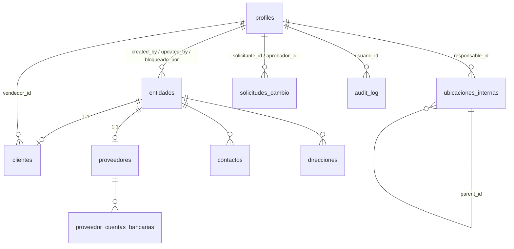

# Esquema de base de datos — RTB Sistema

Referencia técnica de todas las tablas de `public` en Supabase (proyecto
`RTB-App`, ref `dgafffpbhktxadiqmmwl`, PostgreSQL 17). Generada a partir del
esquema real (`list_tables` vía MCP) el 2026-08-05, no sólo de los archivos de
migración — si diverge de lo que ves en Supabase, la base de datos real manda;
avísalo para corregir este documento.

**Los `.sql` en `db/migrations/` son la fuente de verdad autoritativa** (DDL
completo, orden de aplicación, comentarios de "por qué"). Este documento es la
referencia de lectura rápida: qué tabla tiene qué campo, qué se relaciona con
qué, qué no te va a dejar hacer y por qué.

Documentación de procesos (cómo se usa esto paso a paso) en `db/procesos/`.

## Convenciones que se repiten en todo el esquema

- **UUID como PK**, `default gen_random_uuid()`.
- **Trazabilidad**: `created_at`/`updated_at` (`timestamptz`, triggers
  `BEFORE UPDATE` los mantienen), y en las tablas de RTB-ENT-01 también
  `created_by`/`updated_by` (`uuid → profiles(id)`, `default auth.uid()`).
- **Sin borrado físico**: ninguna tabla de negocio tiene `GRANT DELETE` para
  `authenticated`. "Borrar" es `activo = false` o un cambio de `estado`.
- **RLS habilitado en las 10 tablas**, sin excepción, desde el `CREATE TABLE`.
- **Doble barrera**: `REVOKE ALL` + `GRANT` explícito (a veces por columna)
  *antes* de la política RLS. El privilegio de tabla se comprueba primero — sin
  el `GRANT`, la política nunca llega a evaluarse (pasó de verdad, ver
  `contexto/AUDITORIA_RTB-ENT-01.md` hallazgo 22).
- **`current_user_role()`** (ver más abajo) devuelve `NULL` si el usuario está
  desactivado, y `NULL = any(...)` es `NULL` → RLS lo trata como falso. Un
  usuario con `is_active=false` no ve nada, en ninguna tabla, con sesión viva o
  sin ella.
- **Campos sensibles**: cuando una columna sólo debe cambiar a través de un
  flujo de aprobación o de la API con `service_role`, no está en el `GRANT
  UPDATE (...)` de `authenticated`. Intentar escribirla directo por RLS/PostgREST
  falla con `42501`, no con un error de aplicación.

## Extensiones

| Extensión | Para qué |
|---|---|
| `pgcrypto` | `gen_random_uuid()` (ya es núcleo de Postgres, se deja por compatibilidad con el DDL original) |
| `pg_trgm` | Búsqueda por substring/prefijo (`clave`, `rfc`, `codigo`, `nombre` de ubicaciones) — vive en `public`, el linter de Supabase lo marca WARN (aceptado, no se movió de esquema) |

## Tipos enumerados (enums)

| Enum | Valores | Tabla(s) |
|---|---|---|
| `entidad_tipo` | `cliente`, `proveedor`, `mixta` | `entidades` |
| `entidad_estado` | `borrador`, `activo`, `bloqueado_temporal`, `bloqueado_permanente`, `inactivo` | `entidades` |
| `persona_tipo` | `fisica`, `moral` | `entidades` |
| `contacto_tipo` | `principal`, `facturacion`, `compras`, `ventas`, `tesoreria`, `operativo` | `contactos` |
| `direccion_tipo` | `fiscal`, `envio`, `cobro`, `bodega`, `sucursal`, `oficina` | `direcciones` |
| `condicion_pago` | `credito_abierto`, `contado`, `anticipo_requerido` | `proveedores` |
| `canal_origen` | `ariba`, `correo`, `whatsapp`, `telefono`, `mostrador`, `otro` | `clientes` |
| `solicitud_estado` | `pendiente`, `aprobada`, `rechazada`, `cancelada` | `solicitudes_cambio` |
| `cambio_controlado` | `rfc`, `razon_social`, `limite_credito`, `condicion_proveedor`, `reactivacion`, `bloqueo_temporal` | `solicitudes_cambio.tipo_cambio` |
| `ubicacion_tipo` | `centro_operativo`, `zona`, `pasillo`, `rack`, `posicion` | `ubicaciones_internas` |
| `ubicacion_clasificacion` | `fisica`, `logica`, `especial` | `ubicaciones_internas` |
| `ubicacion_uso_especial` | `cuarentena`, `devoluciones`, `material_danado`, `recepcion`, `embarque`, `picking` | `ubicaciones_internas` |
| `cuenta_bancaria_estado` | `pendiente_aprobacion`, `activa`, `pendiente_reemplazo`, `inactiva`, `rechazada` | `proveedor_cuentas_bancarias` |

`profiles.role` **no** es un enum de Postgres — es `TEXT` con un `CHECK`
(`001_auth_profiles.sql`), a propósito, para poder agregar un rol nuevo sin
`ALTER TYPE`.

## Funciones auxiliares (`SECURITY DEFINER`, usadas por las políticas RLS)

| Función | Devuelve | Uso |
|---|---|---|
| `is_super_admin()` | `boolean` | Rompe la recursión RLS de `profiles` |
| `is_active_user()` | `boolean` | Reutilizable por cualquier módulo |
| `current_user_role()` | `text` (`NULL` si inactivo) | La que usan **todas** las políticas de RTB-ENT-01 |
| `usuarios_directorio()` | tabla `(id, full_name, role)` | Rotular "creado por"/"aprobó" sin exponer todo `profiles` |
| `handle_updated_at()` | trigger | `updated_at` (tablas sin `updated_by`, p.ej. `profiles`, `solicitudes_cambio`) |
| `set_updated_meta()` | trigger | `updated_at` + `updated_by` (tablas con ambas columnas) |
| `entidades_before_insert()` / `entidades_before_update()` | trigger | Genera `clave`, normaliza RFC/CURP, protege `clave` |
| `sync_entidad_tipo()` | trigger | Promueve `entidades.tipo` a `mixta` |
| `audit_row()` | trigger | Escribe en `audit_log` en cada INSERT/UPDATE |
| `ubicaciones_before_insert()` / `ubicaciones_before_update()` | trigger | Calcula `nivel`/`codigo`, valida taxonomía, bloquea que `almacen` desactive |
| `ubicacion_tipo_rango(tipo)` | `smallint` | Orden semántico de la taxonomía de ubicaciones |
| `clabe_valida(clabe)` | `boolean` | Algoritmo de dígito verificador de CLABE (P03 §V) |
| `pcb_before_update()` | trigger | `updated_at`/`updated_by` + protege `clabe`/`proveedor_id` |
| `proveedor_cuentas_resumen(proveedor_id?)` | tabla enmascarada | CLABE `****1234` para `direccion` |
| `tiene_operaciones_abiertas(entidad_id)` | `boolean` | Punto de extensión para Ventas/Compras — hoy siempre `false` |

Todas llevan `SET search_path = public, pg_temp` (evita inyección de esquema) y
las que son sólo para disparar por trigger (`entidades_before_insert`,
`sync_entidad_tipo`) tienen `REVOKE EXECUTE FROM PUBLIC, anon, authenticated` —
no deben invocarse directo vía `/rest/v1/rpc/...`.

---

## Diagrama de relaciones

`solicitudes_cambio` y `audit_log` referencian filas de `entidades`/`clientes`/
`proveedores` por `(tabla, registro_id)` genérico — **no** son claves foráneas
reales (no se puede modelar "FK a una de varias tablas" en Postgres sin
partición o triggers extra; se optó por la variante simple + validación en la
capa de API, documentado en `app/lib/entidades/schemas.ts`).

---

## `profiles`

*(Módulo 1 — Autenticación. Documentado en detalle en
`contexto/AUDITORIA_MODULO_AUTH.md`; aquí sólo la referencia de campos porque
todo lo demás cuelga de esta tabla.)*

| Columna | Tipo | Null | Default | Restricción |
|---|---|---|---|---|
| `id` | uuid (PK) | no | — | `REFERENCES auth.users(id) ON DELETE CASCADE` |
| `full_name` | text | no | — | `length(btrim(full_name)) > 0` |
| `role` | text | no | — | `IN ('super_admin','direccion','ventas','compras','almacen','logistica','facturacion','finanzas')` |
| `is_active` | boolean | no | `true` | |
| `created_at` / `updated_at` | timestamptz | no | `now()` | |

**Grants:** `authenticated` sólo `SELECT` + `UPDATE (full_name)`. Sin
`INSERT`/`DELETE` (altas y bajas van por `service_role` desde
`/api/admin/users`). **RLS:** ves tu propia fila, o todas si eres
`super_admin` activo.

---

## `entidades`

Maestro único de clientes/proveedores/mixtas. **Único dueño del estado y el
bloqueo** de todo el árbol de RTB-ENT-01.

| Columna | Tipo | Null | Default | Restricción |
|---|---|---|---|---|
| `id` | uuid (PK) | no | `gen_random_uuid()` | |
| `clave` | varchar(12) | no | — | único, autogenerada (`ENT-000123`), **inmutable** tras el alta |
| `nombre_legal` | varchar(200) | no | — | "modificación controlada" (razón social) |
| `nombre_comercial` | varchar(200) | sí | — | |
| `tipo` | `entidad_tipo` | no | — | se promueve solo a `mixta` |
| `persona_tipo` | `persona_tipo` | no | — | |
| `rfc` | varchar(13) | sí | — | longitud 12/13; único salvo `XAXX010101000`/`XEXX010101000`; "modificación controlada" |
| `curp` | varchar(18) | sí | — | |
| `regimen_fiscal` | varchar(100) | sí | — | |
| `correo_principal` | varchar(254) | sí | — | formato email |
| `telefono_principal` | varchar(30) | sí | — | |
| `sitio_web` | varchar(200) | sí | — | |
| `observaciones` | text | sí | — | |
| `estado` | `entidad_estado` | no | `'activo'` | alta directa a `activo`, no a `borrador` |
| `bloqueo_motivo` / `bloqueado_at` / `bloqueado_por` | text / timestamptz / uuid | sí | — | consistentes entre sí (CHECK: los tres o ninguno) |
| `created_by` / `updated_by` | uuid → `profiles(id)` | sí | `auth.uid()` en alta | |
| `created_at` / `updated_at` | timestamptz | no | `now()` | |

**Índices:** único parcial de `rfc`, GIN de búsqueda de texto
(`nombre_legal`/`nombre_comercial`), trigram de `clave`/`rfc`, btree de
`estado`/`tipo`.

**Grants a `authenticated`:** `SELECT`, `INSERT` (sin restricción de
columna — el alta necesita `nombre_legal`/`rfc`/`tipo` de una vez), `UPDATE`
sólo de `(nombre_comercial, correo_principal, telefono_principal, sitio_web,
observaciones)`. `nombre_legal`/`rfc`/`estado`/`bloqueo_*`/`clave` sólo por
`service_role` (la API aplica primero la lógica de aprobación).

**RLS:** `SELECT` para los 8 roles; `INSERT`/`UPDATE` para
`super_admin`/`direccion`/`ventas`/`compras`.

---

## `clientes` (extensión 1:1 de `entidades`)

| Columna | Tipo | Null | Default | Restricción |
|---|---|---|---|---|
| `id` | uuid (PK) | no | `gen_random_uuid()` | |
| `entidad_id` | uuid (único) → `entidades(id)` | no | — | `ON DELETE RESTRICT` |
| `limite_credito` | numeric(14,2) | no | `0` | `>= 0`; **"modificación controlada" sobre $100,000** |
| `dias_credito` / `dias_gracia` | integer | no | `0` | `>= 0` |
| `lista_precio` | varchar(50) | sí | — | |
| `descuento_maximo` | numeric(5,2) | no | `0` | `0..100` |
| `vendedor_id` | uuid → `profiles(id)` | sí | — | no expuesto todavía en el formulario de alta |
| `canal_origen` | `canal_origen` | sí | — | |

**Grants:** `SELECT`/`INSERT` libres; `UPDATE` de `(dias_credito, dias_gracia,
lista_precio, descuento_maximo, vendedor_id, canal_origen)`.
`limite_credito` **no** es de escritura directa — sólo `service_role`.
**RLS:** `SELECT` para los 8 roles; `INSERT`/`UPDATE` para
`super_admin`/`direccion`/`ventas`.

---

## `proveedores` (extensión 1:1 de `entidades`)

| Columna | Tipo | Null | Default | Restricción |
|---|---|---|---|---|
| `id` | uuid (PK) | no | `gen_random_uuid()` | |
| `entidad_id` | uuid (único) → `entidades(id)` | no | — | `ON DELETE RESTRICT` |
| `categoria` | varchar(100) | sí | — | "modificación controlada" |
| `plazo_pago` | integer | no | `0` | `>= 0` |
| `credito_autorizado` | numeric(14,2) | no | `0` | `>= 0` |
| `moneda_default` | char(3) | no | `'MXN'` | `^[A-Z]{3}$` |
| `condicion_pago` | `condicion_pago` | no | `'contado'` | "modificación controlada" |

**Grants:** `SELECT`/`INSERT` libres; `UPDATE` de `(plazo_pago,
credito_autorizado, moneda_default)`. `categoria`/`condicion_pago` sólo por
`service_role`. **RLS:** `SELECT` para los 8 roles; `INSERT`/`UPDATE` para
`super_admin`/`direccion`/`compras`.

---

## `contactos`

"Modificación libre" (P05) — sin flujo de aprobación en ningún campo.

| Columna | Tipo | Null | Default | Restricción |
|---|---|---|---|---|
| `id` | uuid (PK) | no | `gen_random_uuid()` | |
| `entidad_id` | uuid → `entidades(id)` | no | — | `ON DELETE RESTRICT` |
| `nombre` | varchar(200) | no | — | |
| `cargo` | varchar(100) | sí | — | |
| `tipo` | `contacto_tipo` | no | `'operativo'` | |
| `correo` | varchar(254) | sí | — | formato email |
| `telefono` | varchar(30) | sí | — | |
| `extension` | varchar(10) | sí | — | |
| `es_principal` | boolean | no | `false` | único activo por entidad (índice parcial) |
| `activo` | boolean | no | `true` | "borrado" = `false` |

**Grants:** `SELECT`/`INSERT`/`UPDATE` completos (sin restricción de columna).
**RLS:** `SELECT` para los 8; `INSERT`/`UPDATE` para
`super_admin`/`direccion`/`ventas`/`compras`/`finanzas`.

---

## `direcciones`

"Modificación libre" (P05), igual que contactos.

| Columna | Tipo | Null | Default | Restricción |
|---|---|---|---|---|
| `id` | uuid (PK) | no | `gen_random_uuid()` | |
| `entidad_id` | uuid → `entidades(id)` | no | — | `ON DELETE RESTRICT` |
| `tipo` | `direccion_tipo` | no | — | único principal activo por (entidad, tipo) |
| `calle` | varchar(200) | no | — | |
| `numero_exterior` / `numero_interior` | varchar(20) | sí | — | |
| `colonia` | varchar(120) | sí | — | |
| `ciudad` | varchar(120) | no | — | |
| `entidad_federativa` | varchar(120) | no | — | **no** se llama "estado" (se confundía con el estado del flujo, ver hallazgo 15 de la auditoría) |
| `pais` | varchar(120) | no | `'México'` | |
| `codigo_postal` | varchar(10) | no | — | `^[0-9]{5}$` |
| `referencia` | text | sí | — | |
| `latitud` / `longitud` | numeric(10,7) | sí | — | ambas o ninguna; rango geográfico válido |
| `es_principal` | boolean | no | `false` | |
| `activo` | boolean | no | `true` | |

**Grants/RLS:** iguales a `contactos`, más `almacen`/`logistica` en
`INSERT`/`UPDATE`.

---

## `ubicaciones_internas`

Árbol auto-referencial de centros operativos/zonas/pasillos/racks/posiciones.
Profundidad flexible 1–5: `tipo` debe ser más profundo que el del padre en la
taxonomía (`ubicacion_tipo_rango()`), pero puede saltarse niveles intermedios.

| Columna | Tipo | Null | Default | Restricción |
|---|---|---|---|---|
| `id` | uuid (PK) | no | `gen_random_uuid()` | |
| `parent_id` | uuid → `ubicaciones_internas(id)` | sí | — | `NULL` = raíz del árbol |
| `nivel` | smallint | no | calculado por trigger | `1..5`, profundidad real |
| `segmento` | varchar(30) | no | — | fragmento propio (`Z01`, `R01`); único entre hermanos |
| `codigo` | varchar(160) (único) | no | calculado por trigger | `codigo` del padre + `-` + `segmento` |
| `tipo` | `ubicacion_tipo` | no | — | **inmutable** tras el alta |
| `clasificacion` | `ubicacion_clasificacion` | no | `'fisica'` | independiente del `tipo` jerárquico |
| `uso_especial` | `ubicacion_uso_especial` | sí | — | sólo si `clasificacion='especial'` |
| `nombre` | varchar(120) | no | — | |
| `descripcion` | text | sí | — | |
| `capacidad_posiciones` | integer | sí | — | `> 0`; la ocupación NO se guarda aquí (cálculo de Almacén, módulo futuro) |
| `responsable_id` | uuid → `profiles(id)` | sí | — | |
| `activo` | boolean | no | `true` | `almacen` **no puede** cambiar este campo |

**Grants:** `SELECT`/`INSERT` libres; `UPDATE` de `(nombre, descripcion,
responsable_id, capacidad_posiciones, clasificacion, uso_especial, activo)` —
`parent_id`/`segmento`/`codigo`/`nivel`/`tipo` los protege el trigger, no el
grant (útil para insert, inmutable después). **RLS:** `SELECT` para los 8;
`INSERT`/`UPDATE` para `super_admin`/`direccion`/`almacen`.

---

## `proveedor_cuentas_bancarias`

Acceso más restringido del esquema (P03): **sólo `finanzas`/`super_admin`
tocan esta tabla.** `direccion` sólo ve un resumen enmascarado vía
`proveedor_cuentas_resumen()` — no tiene RLS sobre la tabla base en absoluto.

| Columna | Tipo | Null | Default | Restricción |
|---|---|---|---|---|
| `id` | uuid (PK) | no | `gen_random_uuid()` | |
| `proveedor_id` | uuid → `proveedores(id)` | no | — | `ON DELETE RESTRICT` |
| `banco` | varchar(120) | no | — | |
| `clabe` | char(18) | no | — | `clabe_valida()` — dígito verificador real, no sólo longitud |
| `cuenta` | varchar(20) | sí | — | |
| `titular` | varchar(200) | no | — | |
| `rfc_beneficiario` | varchar(13) | no | — | longitud 12/13 |
| `moneda` | char(3) | no | `'MXN'` | `^[A-Z]{3}$` |
| `comprobante_path` | text | no | — | ruta en el bucket privado, nunca URL pública |
| `estado` | `cuenta_bancaria_estado` | no | `'pendiente_aprobacion'` | única `activa` por proveedor (índice parcial) |
| `motivo_cambio` | text | sí | — | obligatorio si reemplaza una cuenta activa |
| `motivo_rechazo` | text | sí | — | obligatorio si `estado='rechazada'` |
| `aprobada_por` / `aprobada_at` | uuid / timestamptz | sí | — | obligatorios si `estado='activa'` |

**Grants:** `SELECT`/`INSERT` para `finanzas`/`super_admin` (vía RLS, no
`authenticated` en general); `UPDATE` de `(banco, cuenta, titular,
rfc_beneficiario, comprobante_path, motivo_cambio)`. `estado`/`aprobada_*`/
`motivo_rechazo` sólo `service_role`. `clabe`/`proveedor_id` inmutables tras
el alta (trigger). **RLS:** `SELECT`/`INSERT`/`UPDATE` sólo
`finanzas`/`super_admin` — ningún otro rol, ni `direccion`.

**Storage:** bucket privado `comprobantes-bancarios` (10 MB máx.,
`pdf`/`jpeg`/`png`), políticas de `storage.objects` con el mismo criterio de
rol. Se accede siempre por URL firmada de 60s generada en el servidor
(`GET /api/proveedores/[id]/cuentas/[cid]/comprobante`).

---

## `audit_log`

Append-only. Existe para sobrevivir a lo que describe.

| Columna | Tipo | Null | Default |
|---|---|---|---|
| `id` | uuid (PK) | no | `gen_random_uuid()` |
| `tabla` | varchar(60) | no | — |
| `registro_id` | uuid | no | — |
| `accion` | varchar(40) | no | — | `insert`/`update`/`bloqueo_temporal`/`bloqueo_permanente`/`desbloqueo`/`aprobacion`/`rechazo`... |
| `campo` | varchar(120) | sí | — | (reservado, no se usa todavía) |
| `datos_anteriores` / `datos_nuevos` | jsonb | sí | — | fila completa (`to_jsonb(old/new)`), sólo en las entradas que dispara el trigger genérico |
| `motivo` | text | sí | — | sólo en eventos de negocio escritos explícitamente desde la API |
| `usuario_id` | uuid → `profiles(id)` | sí | — | **`ON DELETE SET NULL`** — el historial sobrevive aunque se borre la cuenta |
| `ip` / `user_agent` | inet / text | sí | — | sólo en eventos de negocio (un trigger de Postgres no ve la IP HTTP) |
| `created_at` | timestamptz | no | `now()` | |

**Dos escritores:** el trigger genérico `audit_row()` (dispara en cada
INSERT/UPDATE de las 8 tablas de negocio, `usuario_id` = `auth.uid()` —
`NULL` si la operación la hizo `service_role`) y las rutas de API para
eventos de negocio (bloqueo, aprobación) que necesitan IP/motivo y usan el
cliente admin.

**Grants:** ningún `GRANT` a `authenticated` salvo `SELECT` — nunca
`INSERT`/`UPDATE`/`DELETE` (sólo escribe `audit_row()`, que es
`SECURITY DEFINER`, o `service_role` para los eventos de negocio). **RLS:**
`SELECT` sólo `super_admin`/`direccion`.

---

## `solicitudes_cambio`

Cola de aprobación de "modificación controlada" (P05 §II).

| Columna | Tipo | Null | Default |
|---|---|---|---|
| `id` | uuid (PK) | no | `gen_random_uuid()` |
| `tabla` | varchar(60) | no | — | `entidades`/`clientes`/`proveedores` |
| `registro_id` | uuid | no | — | |
| `tipo_cambio` | `cambio_controlado` | no | — | determina el aprobador (`app/lib/entidades/permisos.ts::REGLAS_APROBACION`) |
| `cambios` | jsonb | no | — | `{columna: valor_nuevo}`, sólo objeto |
| `motivo` | text | no | — | no vacío |
| `solicitante_id` | uuid → `profiles(id)` | no | `auth.uid()` | |
| `estado` | `solicitud_estado` | no | `'pendiente'` | |
| `aprobador_id` / `comentario_resolucion` / `resuelto_at` | uuid / text / timestamptz | sí | — | los tres `NULL` mientras `estado='pendiente'`, los tres presentes si no |

**Grants:** `SELECT`/`INSERT` para `authenticated` (vía RLS); la resolución
(`estado`/`aprobador_id`/`comentario_resolucion`/`resuelto_at`) **sólo**
`service_role` — nadie puede aprobar su propia solicitud a nivel de
privilegio de columna, ni con RLS a medias. **RLS:** ves las tuyas o todas si
eres `super_admin`/`direccion`; insertas sólo lo tuyo
(`solicitante_id = auth.uid()`) si tu rol puede iniciar ese `tipo_cambio`. Sin
política de `UPDATE` — la resolución va siempre por la API.

---

## Advisors de Supabase aceptados (no son bugs)

`get_advisors` marca estos `WARN` de forma permanente y ya evaluada — no
"arreglar" sin releer por qué:

- `pg_trgm` en el esquema `public` (no en uno dedicado).
- Las funciones `is_super_admin`/`is_active_user`/`current_user_role`/
  `usuarios_directorio`/`proveedor_cuentas_resumen`/`rls_auto_enable` son
  `SECURITY DEFINER` y quedan expuestas como RPC de PostgREST — sólo revelan
  información derivada del propio `auth.uid()` de quien llama.
- Protección de contraseñas filtradas (HaveIBeenPwned) desactivada en Auth —
  ajeno a este esquema, pendiente de decisión de producto.
