# Esquema de base de datos — RTB Sistema

Referencia técnica de todas las tablas de `public` en Supabase (proyecto
`RTB-App`, ref `dgafffpbhktxadiqmmwl`, PostgreSQL 17). Generada a partir del
esquema real (`list_tables` vía MCP) el 2026-08-05, no sólo de los archivos de
migración — si diverge de lo que ves en Supabase, la base de datos real manda;
avísalo para corregir este documento.

**Los `.sql` en `db/migrations/` son la fuente de verdad autoritativa** (DDL
completo, orden de aplicación, comentarios de "por qué"). Este documento es la
referencia de lectura rápida: qué tabla tiene qué campo, qué se relaciona con
qué, qué no te va a dejar hacer y por qué.

Documentación de procesos (cómo se usa esto paso a paso) en `db/procesos/`.

## Convenciones que se repiten en todo el esquema

- **UUID como PK**, `default gen_random_uuid()`.
- **Trazabilidad**: `created_at`/`updated_at` (`timestamptz`, triggers
  `BEFORE UPDATE` los mantienen), y en las tablas de RTB-ENT-01 también
  `created_by`/`updated_by` (`uuid → profiles(id)`, `default auth.uid()`).
- **Sin borrado físico**: ninguna tabla de negocio tiene `GRANT DELETE` para
  `authenticated`. "Borrar" es `activo = false` o un cambio de `estado`.
- **RLS habilitado en las 10 tablas**, sin excepción, desde el `CREATE TABLE`.
- **Doble barrera**: `REVOKE ALL` + `GRANT` explícito (a veces por columna)
  *antes* de la política RLS. El privilegio de tabla se comprueba primero — sin
  el `GRANT`, la política nunca llega a evaluarse (pasó de verdad, ver
  `contexto/AUDITORIA_RTB-ENT-01.md` hallazgo 22).
- **`current_user_role()`** (ver más abajo) devuelve `NULL` si el usuario está
  desactivado, y `NULL = any(...)` es `NULL` → RLS lo trata como falso. Un
  usuario con `is_active=false` no ve nada, en ninguna tabla, con sesión viva o
  sin ella.
- **Campos sensibles**: cuando una columna sólo debe cambiar a través de un
  flujo de aprobación o de la API con `service_role`, no está en el `GRANT
  UPDATE (...)` de `authenticated`. Intentar escribirla directo por RLS/PostgREST
  falla con `42501`, no con un error de aplicación.

## Extensiones

| Extensión | Para qué |
|---|---|
| `pgcrypto` | `gen_random_uuid()` (ya es núcleo de Postgres, se deja por compatibilidad con el DDL original) |
| `pg_trgm` | Búsqueda por substring/prefijo (`clave`, `rfc`, `codigo`, `nombre` de ubicaciones) — vive en `public`, el linter de Supabase lo marca WARN (aceptado, no se movió de esquema) |

## Tipos enumerados (enums)

| Enum | Valores | Tabla(s) |
|---|---|---|
| `entidad_tipo` | `cliente`, `proveedor`, `mixta` | `entidades` |
| `entidad_estado` | `borrador`, `activo`, `bloqueado_temporal`, `bloqueado_permanente`, `inactivo` | `entidades` |
| `persona_tipo` | `fisica`, `moral` | `entidades` |
| `contacto_tipo` | `principal`, `facturacion`, `compras`, `ventas`, `tesoreria`, `operativo` | `contactos` |
| `direccion_tipo` | `fiscal`, `envio`, `cobro`, `bodega`, `sucursal`, `oficina` | `direcciones` |
| `condicion_pago` | `credito_abierto`, `contado`, `anticipo_requerido` | `proveedores` |
| `canal_origen` | `ariba`, `correo`, `whatsapp`, `telefono`, `mostrador`, `otro` | `clientes` |
| `solicitud_estado` | `pendiente`, `aprobada`, `rechazada`, `cancelada` | `solicitudes_cambio` |
| `cambio_controlado` | `rfc`, `razon_social`, `limite_credito`, `condicion_proveedor`, `reactivacion`, `bloqueo_temporal` | `solicitudes_cambio.tipo_cambio` |
| `ubicacion_tipo` | `centro_operativo`, `zona`, `pasillo`, `rack`, `posicion` | `ubicaciones_internas` |
| `ubicacion_clasificacion` | `fisica`, `logica`, `especial` | `ubicaciones_internas` |
| `ubicacion_uso_especial` | `cuarentena`, `devoluciones`, `material_danado`, `recepcion`, `embarque`, `picking` | `ubicaciones_internas` |
| `cuenta_bancaria_estado` | `pendiente_aprobacion`, `activa`, `pendiente_reemplazo`, `inactiva`, `rechazada` | `proveedor_cuentas_bancarias` |
| `unidad_tipo` | `conteo`, `agrupacion`, `longitud`, `peso`, `volumen` | `unidades_medida` |
| `producto_estado` | `borrador`, `activo`, `requiere_depuracion`, `descontinuado`, `fusionado` | `productos` |
| `costo_origen` | `compra`, `catalogo_manual`, `proveedor_preferente`, `carga_inicial` | `producto_costos` |
| `precio_canal` | `refaccion`, `ariba`, `mostrador`, `lista_general` | `producto_precios_referencia` |
| `apartado_estado` | `activo`, `liberado`, `consumido` | `inventario_apartados` |
| `movimiento_tipo` | 8 `entrada_*` + 8 `salida_*` (ver `db/migrations/011_inventario_kardex.sql`) | `inventario_movimientos` |
| `conteo_estado` | `planificado`, `congelado`, `en_captura`, `en_conciliacion`, `cerrado`, `aplicado`, `cancelado` | `inventario_conteos` |
| `conteo_tipo` | `general`, `ciclico`, `por_ubicacion`, `por_familia`, `puntual`, `reconteo` | `inventario_conteos` |
| `conteo_linea_estado` | `no_visitada`, `contada`, `recontada`, `no_localizada`, `ubicacion_incorrecta`, `bloqueada` | `inventario_conteo_detalles` |
| `firma_rol` | `contador`, `supervisor`, `gerente_operaciones`, `testigo` | `inventario_conteo_firmas` |
| `ajuste_estado` | `borrador`, `pendiente_autorizacion`, `autorizado`, `aplicado`, `rechazado`, `cancelado` | `inventario_ajustes`, `producto_unidad_redefiniciones` |
| `ajuste_tipo` | `conteo`, `reubicacion`, `correccion_captura`, `redefinicion_unidad`, `carga_inicial`, `merma`, `otro` | `inventario_ajustes` |
| `discrepancia_banda` | `documental`, `movimiento`, `regularizacion`, `sistema` | `inventario_discrepancias`, `inventario_hallazgos` |
| `discrepancia_salida` | `ubi`, `cap`, `aju`, `aju_sin_soporte`, `justificado`, `hal`, `men` | `inventario_discrepancias` |
| `discrepancia_estado` | `abierta`, `en_investigacion`, `con_causa`, `resuelta`, `hallazgo`, `cancelada` | `inventario_discrepancias` |
| `hallazgo_estado` | `abierto`, `en_seguimiento`, `cerrado_con_causa`, `cerrado_sin_causa` | `inventario_hallazgos` |

`profiles.role` **no** es un enum de Postgres — es `TEXT` con un `CHECK`
(`001_auth_profiles.sql`), a propósito, para poder agregar un rol nuevo sin
`ALTER TYPE`.

## Funciones auxiliares (`SECURITY DEFINER`, usadas por las políticas RLS)

| Función | Devuelve | Uso |
|---|---|---|
| `is_super_admin()` | `boolean` | Rompe la recursión RLS de `profiles` |
| `is_active_user()` | `boolean` | Reutilizable por cualquier módulo |
| `current_user_role()` | `text` (`NULL` si inactivo) | La que usan **todas** las políticas de RTB-ENT-01 |
| `usuarios_directorio()` | tabla `(id, full_name, role)` | Rotular "creado por"/"aprobó" sin exponer todo `profiles` |
| `handle_updated_at()` | trigger | `updated_at` (tablas sin `updated_by`, p.ej. `profiles`, `solicitudes_cambio`) |
| `set_updated_meta()` | trigger | `updated_at` + `updated_by` (tablas con ambas columnas) |
| `entidades_before_insert()` / `entidades_before_update()` | trigger | Genera `clave`, normaliza RFC/CURP, protege `clave` |
| `sync_entidad_tipo()` | trigger | Promueve `entidades.tipo` a `mixta` |
| `audit_row()` | trigger | Escribe en `audit_log` en cada INSERT/UPDATE |
| `ubicaciones_before_insert()` / `ubicaciones_before_update()` | trigger | Calcula `nivel`/`codigo`, valida taxonomía, bloquea que `almacen` desactive |
| `ubicacion_tipo_rango(tipo)` | `smallint` | Orden semántico de la taxonomía de ubicaciones |
| `clabe_valida(clabe)` | `boolean` | Algoritmo de dígito verificador de CLABE (P03 §V) |
| `pcb_before_update()` | trigger | `updated_at`/`updated_by` + protege `clabe`/`proveedor_id` |
| `proveedor_cuentas_resumen(proveedor_id?)` | tabla enmascarada | CLABE `****1234` para `direccion` |
| `tiene_operaciones_abiertas(entidad_id)` | `boolean` | Punto de extensión para Ventas/Compras — hoy siempre `false` |
| `movimiento_signo(tipo)` | `smallint` (`+1`/`-1`) | Signo de un tipo de movimiento de kardex |
| `costo_unitario_vigente(producto_id, fecha?)` | `numeric` | Cascada promedio→catálogo→proveedor preferente |
| `productos_before_insert()` / `productos_guard_unidad()` | trigger | Folio `RTB-<familia>-000123`; la unidad de medida sólo cambia vía redefinición autorizada |
| `inventario_movimientos_before_insert()` | trigger | El trigger que hace todo: factor de conversión, lock de existencias, costo promedio, bloqueo de negativo, congelamiento, autorización de ajuste |
| `inventario_movimientos_inmutable()` / `movimiento_valida_par()` | trigger | Kardex append-only incluso para `service_role`; cross-dock/transferencia exigen su par al `COMMIT` |
| `inventario_congelamiento_activo(producto_id, ubicacion_id)` | `uuid` (folio de conteo o `NULL`) | Resuelve el congelamiento vigente contra el árbol de `ubicaciones_internas` |
| `ajuste_autorizado(ajuste_id)` | `boolean` | `false` hasta que el ajuste esté `autorizado`/`aplicado` — la barrera real del kardex |
| `inventario_congelar_conteo(conteo_id)` (`016`) | `integer` (líneas generadas) | Congela un conteo — resuelve `alcance`, genera `inventario_conteo_detalles` y `inventario_congelamientos` en una sola transacción atómica. `SECURITY DEFINER` invocada por el cliente del **propio usuario**, no `service_role` — así gana el privilegio sobre tablas con `GRANT` restringido sin perder el contexto JWT que hace que `auth.uid()` resuelva al actor real (antes: `congelado_por` violaba NOT NULL bajo `service_role`, ver `contexto/AUDITORIA_QA_ROLES_2026-08-06.md` E-01) |
| `inventario_aplicar_conteo(conteo_id)` (`016`) | `integer` (existencias actualizadas) | Aplica un conteo `cerrado`: `UPDATE ... FROM` set-based que copia `cantidad_fisica` a `inventario_existencias`. Mismo patrón que congelar; el chequeo de rol (`super_admin`/`direccion`) vive en la función, no en la ruta (E-04) |
| `inventario_conteos_after_update_liberar()` (`016`) | trigger `AFTER UPDATE` | Libera automáticamente los congelamientos de un conteo al pasar a `aplicado`/`cancelado` — ya no tienen motivo para seguir bloqueando el kardex (E-05) |
| `conteo_conciliacion(conteo_id)` | tabla con teórico visible | La única puerta a `cantidad_teorica`/`diferencia` durante la captura — vista ciega real |
| `inventario_exactitud(conteo_id)` | tabla (`cobertura`/`registro`/`pieza`/`valor`) | Exactitud sobre 4 bases; cobertura es la que impide un 100% ficticio |
| `inventario_alerta_stock(producto_id?)` | tabla | Alerta ⚪/🔴/🟢, bloqueo de compra y acción sugerida (RTB-PRO-COM-01 §III) |
| `inventario_verificar_consistencia()` | tabla | Consola de auditoría — sólo `super_admin`/`direccion`; `ajuste_sin_autorizacion` debería ser siempre 0 filas |

Todas llevan `SET search_path = public, pg_temp` (evita inyección de esquema) y
las que son sólo para disparar por trigger (`entidades_before_insert`,
`sync_entidad_tipo`) tienen `REVOKE EXECUTE FROM PUBLIC, anon, authenticated` —
no deben invocarse directo vía `/rest/v1/rpc/...`.

---

## Diagrama de relaciones

```mermaid
erDiagram
    profiles ||--o{ entidades : "created_by / updated_by / bloqueado_por"
    entidades ||--o| clientes : "1:1"
    entidades ||--o| proveedores : "1:1"
    entidades ||--o{ contactos : ""
    entidades ||--o{ direcciones : ""
    proveedores ||--o{ proveedor_cuentas_bancarias : ""
    profiles ||--o{ clientes : "vendedor_id"
    ubicaciones_internas ||--o{ ubicaciones_internas : "parent_id"
    profiles ||--o{ ubicaciones_internas : "responsable_id"
    profiles ||--o{ solicitudes_cambio : "solicitante_id / aprobador_id"
    profiles ||--o{ audit_log : "usuario_id"
    producto_familias ||--o{ productos : "familia_id"
    producto_categorias ||--o{ productos : ""
    producto_marcas ||--o{ productos : "marca_id"
    unidades_medida ||--o{ productos : "unidad_medida_id / unidad_contenido_id"
    productos ||--o{ productos : "producto_canonico_id (fusión)"
    proveedores ||--o{ proveedor_productos : ""
    productos ||--o{ proveedor_productos : ""
    productos ||--o{ producto_costos : ""
    productos ||--o{ inventario_existencias : ""
    ubicaciones_internas ||--o{ inventario_existencias : ""
    productos ||--o{ inventario_movimientos : ""
    ubicaciones_internas ||--o{ inventario_movimientos : ""
    inventario_conteos ||--o{ inventario_movimientos : "conteo_id"
    inventario_ajustes ||--o{ inventario_movimientos : "ajuste_id"
    inventario_apartados ||--o{ inventario_movimientos : ""
    inventario_conteos ||--o{ inventario_conteo_detalles : ""
    inventario_conteos ||--o{ inventario_conteo_asignaciones : ""
    inventario_conteos ||--o{ inventario_congelamientos : ""
    inventario_conteos ||--o{ inventario_conteo_firmas : ""
    inventario_conteos ||--o{ inventario_conteo_versiones : ""
    inventario_conteo_detalles ||--o{ inventario_discrepancias : ""
    inventario_ajustes ||--o{ inventario_discrepancias : ""
    inventario_hallazgos ||--o{ inventario_discrepancias : ""
    inventario_discrepancias ||--o{ inventario_discrepancias : "discrepancia_par_id"
    inventario_ajustes ||--o{ inventario_ajuste_lineas : ""
    inventario_discrepancias ||--o{ inventario_ajuste_lineas : ""
    inventario_movimientos ||--o{ inventario_ajuste_lineas : "movimiento_id"
    productos ||--o{ producto_unidad_redefiniciones : ""
    inventario_conteos ||--o{ producto_unidad_redefiniciones : ""
    inventario_ajustes ||--o{ producto_unidad_redefiniciones : ""
```

RTB-INV-01 (`db/migrations/009`…`015`) añade 22 tablas nuevas a este mismo
esquema — su diagrama vive fusionado arriba, no aparte, porque referencia
directamente `profiles`, `proveedores` y `ubicaciones_internas` de
RTB-ENT-01. Detalle tabla por tabla en `contexto/RTB-INV-01_Modulo_Productos_Inventario.md`
§2; el resumen de columnas de cada tabla nueva está más abajo, después de
`solicitudes_cambio`.

`solicitudes_cambio` y `audit_log` referencian filas de `entidades`/`clientes`/
`proveedores` por `(tabla, registro_id)` genérico — **no** son claves foráneas
reales (no se puede modelar "FK a una de varias tablas" en Postgres sin
partición o triggers extra; se optó por la variante simple + validación en la
capa de API, documentado en `app/lib/entidades/schemas.ts`).

---

## `profiles`

*(Módulo 1 — Autenticación. Documentado en detalle en
`contexto/AUDITORIA_MODULO_AUTH.md`; aquí sólo la referencia de campos porque
todo lo demás cuelga de esta tabla.)*

| Columna | Tipo | Null | Default | Restricción |
|---|---|---|---|---|
| `id` | uuid (PK) | no | — | `REFERENCES auth.users(id) ON DELETE CASCADE` |
| `full_name` | text | no | — | `length(btrim(full_name)) > 0` |
| `role` | text | no | — | `IN ('super_admin','direccion','ventas','compras','almacen','logistica','facturacion','finanzas')` |
| `is_active` | boolean | no | `true` | |
| `created_at` / `updated_at` | timestamptz | no | `now()` | |

**Grants:** `authenticated` sólo `SELECT` + `UPDATE (full_name)`. Sin
`INSERT`/`DELETE` (altas y bajas van por `service_role` desde
`/api/admin/users`). **RLS:** ves tu propia fila, o todas si eres
`super_admin` activo.

---

## `entidades`

Maestro único de clientes/proveedores/mixtas. **Único dueño del estado y el
bloqueo** de todo el árbol de RTB-ENT-01.

| Columna | Tipo | Null | Default | Restricción |
|---|---|---|---|---|
| `id` | uuid (PK) | no | `gen_random_uuid()` | |
| `clave` | varchar(12) | no | — | único, autogenerada (`ENT-000123`), **inmutable** tras el alta |
| `nombre_legal` | varchar(200) | no | — | "modificación controlada" (razón social) |
| `nombre_comercial` | varchar(200) | sí | — | |
| `siglas` | varchar(12) | sí | — | único parcial, MAYÚSCULAS (normalizada por trigger, `020`), modificación libre |
| `tipo` | `entidad_tipo` | no | — | se promueve solo a `mixta` |
| `persona_tipo` | `persona_tipo` | no | — | |
| `rfc` | varchar(13) | sí | — | longitud 12/13; único salvo `XAXX010101000`/`XEXX010101000`; "modificación controlada" |
| `curp` | varchar(18) | sí | — | |
| `regimen_fiscal` | varchar(100) | sí | — | |
| `correo_principal` | varchar(254) | sí | — | formato email |
| `telefono_principal` | varchar(30) | sí | — | |
| `sitio_web` | varchar(200) | sí | — | |
| `observaciones` | text | sí | — | |
| `estado` | `entidad_estado` | no | `'activo'` | alta directa a `activo`, no a `borrador` |
| `bloqueo_motivo` / `bloqueado_at` / `bloqueado_por` | text / timestamptz / uuid | sí | — | consistentes entre sí (CHECK: los tres o ninguno) |
| `created_by` / `updated_by` | uuid → `profiles(id)` | sí | `auth.uid()` en alta | |
| `created_at` / `updated_at` | timestamptz | no | `now()` | |

**Índices:** único parcial de `rfc`, único parcial de `siglas` (`020`), GIN
de búsqueda de texto (`nombre_legal`/`nombre_comercial`), trigram de
`clave`/`rfc`/`siglas`, btree de `estado`/`tipo`.

**Grants a `authenticated`:** `SELECT`, `INSERT` (sin restricción de
columna — el alta necesita `nombre_legal`/`rfc`/`tipo` de una vez), `UPDATE`
sólo de `(nombre_comercial, correo_principal, telefono_principal, sitio_web,
observaciones, siglas)`. `nombre_legal`/`rfc`/`estado`/`bloqueo_*`/`clave`
sólo por `service_role` (la API aplica primero la lógica de aprobación).

**RLS:** `SELECT` para los 8 roles; `INSERT`/`UPDATE` para
`super_admin`/`direccion`/`ventas`/`compras`.

---

## `clientes` (extensión 1:1 de `entidades`)

| Columna | Tipo | Null | Default | Restricción |
|---|---|---|---|---|
| `id` | uuid (PK) | no | `gen_random_uuid()` | |
| `entidad_id` | uuid (único) → `entidades(id)` | no | — | `ON DELETE RESTRICT` |
| `limite_credito` | numeric(14,2) | no | `0` | `>= 0`; **"modificación controlada" sobre $100,000** |
| `dias_credito` / `dias_gracia` | integer | no | `0` | `>= 0` |
| `lista_precio` | varchar(50) | sí | — | |
| `descuento_maximo` | numeric(5,2) | no | `0` | `0..100` |
| `vendedor_id` | uuid → `profiles(id)` | sí | — | no expuesto todavía en el formulario de alta |
| `canal_origen` | `canal_origen` | sí | — | |

**Grants:** `SELECT`/`INSERT` libres; `UPDATE` de `(dias_credito, dias_gracia,
lista_precio, descuento_maximo, vendedor_id, canal_origen, limite_credito)`
— `limite_credito` se agregó en `019_clientes_limite_credito_grant.sql`
(gap encontrado corrigiendo `contexto/AUDITORIA_QA_ROLES_2026-08-06.md`
E-07: faltaba por completo, así que ni `super_admin` podía aplicar
directo un cambio de crédito ya autorizado). Es seguro porque RLS
(`clientes_update`) ya limita `UPDATE` a `super_admin`/`direccion`/
`ventas`, y en la práctica sólo `super_admin` ejecuta directo — el resto
sigue pasando por `solicitudes_cambio` cuando supera
`UMBRAL_APROBACION_CREDITO` ($100,000). **RLS:** `SELECT` para los 8
roles; `INSERT`/`UPDATE` para `super_admin`/`direccion`/`ventas`.

---

## `proveedores` (extensión 1:1 de `entidades`)

| Columna | Tipo | Null | Default | Restricción |
|---|---|---|---|---|
| `id` | uuid (PK) | no | `gen_random_uuid()` | |
| `entidad_id` | uuid (único) → `entidades(id)` | no | — | `ON DELETE RESTRICT` |
| `categoria` | varchar(100) | sí | — | "modificación controlada" |
| `plazo_pago` | integer | no | `0` | `>= 0` |
| `credito_autorizado` | numeric(14,2) | no | `0` | `>= 0` |
| `moneda_default` | char(3) | no | `'MXN'` | `^[A-Z]{3}$` |
| `condicion_pago` | `condicion_pago` | no | `'contado'` | "modificación controlada" |

**Grants:** `SELECT`/`INSERT` libres; `UPDATE` de `(plazo_pago,
credito_autorizado, moneda_default)`. `categoria`/`condicion_pago` sólo por
`service_role`. **RLS:** `SELECT` para los 8 roles; `INSERT`/`UPDATE` para
`super_admin`/`direccion`/`compras`.

---

## `contactos`

"Modificación libre" (P05) — sin flujo de aprobación en ningún campo.

| Columna | Tipo | Null | Default | Restricción |
|---|---|---|---|---|
| `id` | uuid (PK) | no | `gen_random_uuid()` | |
| `entidad_id` | uuid → `entidades(id)` | no | — | `ON DELETE RESTRICT` |
| `nombre` | varchar(200) | no | — | |
| `cargo` | varchar(100) | sí | — | |
| `tipo` | `contacto_tipo` | no | `'operativo'` | |
| `correo` | varchar(254) | sí | — | formato email |
| `telefono` | varchar(30) | sí | — | |
| `extension` | varchar(10) | sí | — | |
| `es_principal` | boolean | no | `false` | único activo por entidad (índice parcial) |
| `activo` | boolean | no | `true` | "borrado" = `false` |

**Grants:** `SELECT`/`INSERT`/`UPDATE` completos (sin restricción de columna).
**RLS:** `SELECT` para los 8; `INSERT`/`UPDATE` para
`super_admin`/`direccion`/`ventas`/`compras`/`finanzas`.

---

## `direcciones`

"Modificación libre" (P05), igual que contactos.

| Columna | Tipo | Null | Default | Restricción |
|---|---|---|---|---|
| `id` | uuid (PK) | no | `gen_random_uuid()` | |
| `entidad_id` | uuid → `entidades(id)` | no | — | `ON DELETE RESTRICT` |
| `tipo` | `direccion_tipo` | no | — | único principal activo por (entidad, tipo) |
| `calle` | varchar(200) | no | — | |
| `numero_exterior` / `numero_interior` | varchar(20) | sí | — | |
| `colonia` | varchar(120) | sí | — | |
| `ciudad` | varchar(120) | no | — | |
| `entidad_federativa` | varchar(120) | no | — | **no** se llama "estado" (se confundía con el estado del flujo, ver hallazgo 15 de la auditoría) |
| `pais` | varchar(120) | no | `'México'` | |
| `codigo_postal` | varchar(10) | no | — | `^[0-9]{5}$` |
| `referencia` | text | sí | — | |
| `latitud` / `longitud` | numeric(10,7) | sí | — | ambas o ninguna; rango geográfico válido |
| `es_principal` | boolean | no | `false` | |
| `activo` | boolean | no | `true` | |

**Grants/RLS:** iguales a `contactos`, más `almacen`/`logistica` en
`INSERT`/`UPDATE`.

**`latitud`/`longitud` en uso desde `024_ubicaciones_geo.sql`** (2026-08-06):
existían desde `002_entidades_core.sql` pero ninguna pantalla las capturaba
ni las mostraba. El flujo real: `POST/PATCH /api/entidades/[id]/direcciones`
(la pestaña "Contactos y direcciones" de la ficha, con
`components/mapas/{CampoCoordenada,MapaPunto,PropuestaDireccion}`) llama a
`GET /api/geocodificacion?modo=inverso` (Mapbox Geocoding v6,
`app/lib/mapas/mapbox.ts`, `permanent=true` porque el resultado se
persiste) para proponer calle/colonia/ciudad/estado/CP a partir de la
coordenada — el usuario confirma antes de que se sobrescriba nada, nunca
en automático. `GET /api/mapa/puntos` alimenta `/dashboard/mapa`, la vista
de todos los puntos con coordenada (índice parcial `idx_direcciones_geo`).

---

## `ubicaciones_internas`

Árbol auto-referencial de centros operativos/zonas/pasillos/racks/posiciones.
Profundidad flexible 1–5: `tipo` debe ser más profundo que el del padre en la
taxonomía (`ubicacion_tipo_rango()`), pero puede saltarse niveles intermedios.

| Columna | Tipo | Null | Default | Restricción |
|---|---|---|---|---|
| `id` | uuid (PK) | no | `gen_random_uuid()` | |
| `parent_id` | uuid → `ubicaciones_internas(id)` | sí | — | `NULL` = raíz del árbol |
| `nivel` | smallint | no | calculado por trigger | `1..5`, profundidad real |
| `segmento` | varchar(30) | no | — | fragmento propio (`Z01`, `R01`); único entre hermanos |
| `codigo` | varchar(160) (único) | no | calculado por trigger | `codigo` del padre + `-` + `segmento` |
| `tipo` | `ubicacion_tipo` | no | — | **inmutable** tras el alta |
| `clasificacion` | `ubicacion_clasificacion` | no | `'fisica'` | independiente del `tipo` jerárquico |
| `uso_especial` | `ubicacion_uso_especial` | sí | — | sólo si `clasificacion='especial'` |
| `nombre` | varchar(120) | no | — | |
| `descripcion` | text | sí | — | |
| `capacidad_posiciones` | integer | sí | — | `> 0`; la ocupación NO se guarda aquí (cálculo de Almacén, módulo futuro) |
| `responsable_id` | uuid → `profiles(id)` | sí | — | |
| `activo` | boolean | no | `true` | `almacen` **no puede** cambiar este campo |
| `calle`, `numero_exterior`, `numero_interior`, `colonia`, `ciudad`, `entidad_federativa`, `pais`, `codigo_postal`, `referencia` | varchar/text | sí | — | espejo de `direcciones`; `codigo_postal` valida `^[0-9]{5}$` (`ubicaciones_cp_chk`) |
| `latitud` / `longitud` | numeric(10,7) | sí | — | ambas o ninguna; rango geográfico válido (`ubicaciones_geo_chk`, espejo de `direcciones_geo_chk`) |

**`024_ubicaciones_geo.sql`** (2026-08-06) añadió las 11 columnas de
dirección/coordenada de arriba, exclusivas del nivel raíz del árbol:
`ubicaciones_geo_solo_centro_chk` exige que estén todas en `NULL` salvo
cuando `tipo = 'centro_operativo'` — una zona/pasillo/rack/posición
hereda la ubicación de su centro, no captura la suya. Normalizadas con
`nullif(btrim(...), '')` en `ubicaciones_before_insert`/`_before_update`
para que un `''` de formulario no burle el `CHECK`. UI: panel de detalle
de `/dashboard/ubicaciones` (`UbicacionGeoPanel`, sólo visible para
`centro_operativo`) y la sección opcional del modal de alta.

**Grants:** `SELECT`/`INSERT` libres; `UPDATE` de `(nombre, descripcion,
responsable_id, capacidad_posiciones, clasificacion, uso_especial, activo,
calle, numero_exterior, numero_interior, colonia, ciudad,
entidad_federativa, pais, codigo_postal, referencia, latitud, longitud)` —
`parent_id`/`segmento`/`codigo`/`nivel`/`tipo` los protege el trigger, no el
grant (útil para insert, inmutable después). **RLS:** `SELECT` para los 8;
`INSERT`/`UPDATE` para `super_admin`/`direccion`/`almacen`.

---

## `proveedor_cuentas_bancarias`

Acceso más restringido del esquema (P03): **sólo `finanzas`/`super_admin`
tocan esta tabla.** `direccion` sólo ve un resumen enmascarado vía
`proveedor_cuentas_resumen()` — no tiene RLS sobre la tabla base en absoluto.

| Columna | Tipo | Null | Default | Restricción |
|---|---|---|---|---|
| `id` | uuid (PK) | no | `gen_random_uuid()` | |
| `proveedor_id` | uuid → `proveedores(id)` | no | — | `ON DELETE RESTRICT` |
| `banco` | varchar(120) | no | — | |
| `clabe` | char(18) | no | — | `clabe_valida()` — dígito verificador real, no sólo longitud |
| `cuenta` | varchar(20) | sí | — | |
| `titular` | varchar(200) | no | — | |
| `rfc_beneficiario` | varchar(13) | no | — | longitud 12/13 |
| `moneda` | char(3) | no | `'MXN'` | `^[A-Z]{3}$` |
| `comprobante_path` | text | no | — | ruta en el bucket privado, nunca URL pública |
| `estado` | `cuenta_bancaria_estado` | no | `'pendiente_aprobacion'` | única `activa` por proveedor (índice parcial) |
| `motivo_cambio` | text | sí | — | obligatorio si reemplaza una cuenta activa |
| `motivo_rechazo` | text | sí | — | obligatorio si `estado='rechazada'` |
| `aprobada_por` / `aprobada_at` | uuid / timestamptz | sí | — | obligatorios si `estado='activa'` |

**Grants:** `SELECT`/`INSERT` para `finanzas`/`super_admin` (vía RLS, no
`authenticated` en general); `UPDATE` de `(banco, cuenta, titular,
rfc_beneficiario, comprobante_path, motivo_cambio)`. `estado`/`aprobada_*`/
`motivo_rechazo` sólo `service_role`. `clabe`/`proveedor_id` inmutables tras
el alta (trigger). **RLS:** `SELECT`/`INSERT`/`UPDATE` sólo
`finanzas`/`super_admin` — ningún otro rol, ni `direccion`.

**Storage:** bucket privado `comprobantes-bancarios` (10 MB máx.,
`pdf`/`jpeg`/`png`), políticas de `storage.objects` con el mismo criterio de
rol. Se accede siempre por URL firmada de 60s generada en el servidor
(`GET /api/proveedores/[id]/cuentas/[cid]/comprobante`).

---

## `audit_log`

Append-only. Existe para sobrevivir a lo que describe.

| Columna | Tipo | Null | Default |
|---|---|---|---|
| `id` | uuid (PK) | no | `gen_random_uuid()` |
| `tabla` | varchar(60) | no | — |
| `registro_id` | uuid | no | — |
| `accion` | varchar(40) | no | — | `insert`/`update`/`bloqueo_temporal`/`bloqueo_permanente`/`desbloqueo`/`aprobacion`/`rechazo`... |
| `campo` | varchar(120) | sí | — | (reservado, no se usa todavía) |
| `datos_anteriores` / `datos_nuevos` | jsonb | sí | — | fila completa (`to_jsonb(old/new)`), sólo en las entradas que dispara el trigger genérico |
| `motivo` | text | sí | — | sólo en eventos de negocio escritos explícitamente desde la API |
| `usuario_id` | uuid → `profiles(id)` | sí | — | **`ON DELETE SET NULL`** — el historial sobrevive aunque se borre la cuenta |
| `ip` / `user_agent` | inet / text | sí | — | sólo en eventos de negocio (un trigger de Postgres no ve la IP HTTP) |
| `created_at` | timestamptz | no | `now()` | |

**Dos escritores:** el trigger genérico `audit_row()` (dispara en cada
INSERT/UPDATE de las 8 tablas de negocio, `usuario_id` = `auth.uid()` —
`NULL` si la operación la hizo `service_role`) y las rutas de API para
eventos de negocio (bloqueo, aprobación) que necesitan IP/motivo y usan el
cliente admin.

**Grants:** ningún `GRANT` a `authenticated` salvo `SELECT` — nunca
`INSERT`/`UPDATE`/`DELETE` (sólo escribe `audit_row()`, que es
`SECURITY DEFINER`, o `service_role` para los eventos de negocio). **RLS:**
`SELECT` sólo `super_admin`/`direccion`.

---

## `solicitudes_cambio`

Cola de aprobación de "modificación controlada" (P05 §II).

| Columna | Tipo | Null | Default |
|---|---|---|---|
| `id` | uuid (PK) | no | `gen_random_uuid()` |
| `tabla` | varchar(60) | no | — | `entidades`/`clientes`/`proveedores` |
| `registro_id` | uuid | no | — | |
| `tipo_cambio` | `cambio_controlado` | no | — | determina el aprobador (`app/lib/entidades/permisos.ts::REGLAS_APROBACION`) |
| `cambios` | jsonb | no | — | `{columna: valor_nuevo}`, sólo objeto |
| `motivo` | text | no | — | no vacío |
| `solicitante_id` | uuid → `profiles(id)` | no | `auth.uid()` | |
| `estado` | `solicitud_estado` | no | `'pendiente'` | |
| `aprobador_id` / `comentario_resolucion` / `resuelto_at` | uuid / text / timestamptz | sí | — | los tres `NULL` mientras `estado='pendiente'`, los tres presentes si no |

**Grants:** `SELECT`/`INSERT` para `authenticated` (vía RLS); la resolución
(`estado`/`aprobador_id`/`comentario_resolucion`/`resuelto_at`) **sólo**
`service_role` — nadie puede aprobar su propia solicitud a nivel de
privilegio de columna, ni con RLS a medias. **RLS:** ves las tuyas o todas si
eres `super_admin`/`direccion`; insertas sólo lo tuyo
(`solicitante_id = auth.uid()`) si tu rol puede iniciar ese `tipo_cambio`. Sin
política de `UPDATE` — la resolución va siempre por la API.

---

## RTB-INV-01 — Productos, Costos e Inventario

Detalle completo (por qué cada decisión, veredictos frente al paquete
original) en `contexto/AUDITORIA_RTB-INV-01.md`. Aquí sólo el resumen de
columnas — el DDL de `db/migrations/009`…`015` manda.

### `unidades_medida`

| Columna | Tipo | Null | Default | Restricción |
|---|---|---|---|---|
| `clave` | varchar(12) | no | — | único; inmutable tras el alta |
| `nombre` | varchar(60) | no | — | |
| `tipo` | `unidad_tipo` | no | — | |
| `decimales` | smallint | no | `0` | `0..4`; valida la precisión de captura en el kardex |
| `activo` | boolean | no | `true` | |

**Grants:** `INSERT` libre; `UPDATE` de `(nombre, tipo, decimales, activo)`
— `clave` inmutable. **RLS:** 8 roles leen; `super_admin`/`direccion`/
`compras` administran (`015_catalogo_marcas_y_gobierno.sql` sacó a
`almacen` de esta tabla y de `producto_familias`: la unidad de medida mal
definida es la causa #1 de pérdida medida por RTB, y quien la gobierna no
debe ser quien opera el conteo contra ella — ver auditoría).

### `producto_familias`

| Columna | Tipo | Null | Default | Restricción |
|---|---|---|---|---|
| `clave` | varchar(10) | no | — | único; prefijo del folio (`RTB-<clave>-000123`) |
| `nombre` | varchar(120) | no | — | |
| `unidad_medida_default_id` | uuid → `unidades_medida(id)` | sí | — | |
| `requiere_recuento` | boolean | no | `false` | bandera de gobierno para redefiniciones masivas |
| `activo` | boolean | no | `true` | |

Grants iguales a `unidades_medida`. RLS: 8 roles leen; `super_admin`/
`direccion`/`compras` administran (mismo estrechamiento que arriba).

### `producto_categorias`

| Columna | Tipo | Null | Default | Restricción |
|---|---|---|---|---|
| `clave` | varchar(20) | no | — | único |
| `nombre` | varchar(120) | no | — | |
| `activo` | boolean | no | `true` | |

Tabla, no enum — mismo criterio que `profiles.role`. Grants/RLS: 8 roles
leen; `super_admin`/`direccion`/`compras`/`almacen` administran (sin
cambios — `almacen` es quien recibe mercancía nueva y clasifica).

### `producto_marcas`

Añadida en `015_catalogo_marcas_y_gobierno.sql`, sustituye a
`productos.marca` (texto libre, eliminada en la misma migración).

| Columna | Tipo | Null | Default | Restricción |
|---|---|---|---|---|
| `clave` | varchar(20) | no | — | único; inmutable tras el alta |
| `nombre` | varchar(120) | no | — | |
| `descripcion` | text | sí | — | |
| `activo` | boolean | no | `true` | |

Grants/RLS iguales a `producto_categorias`.

### `productos`

| Columna | Tipo | Null | Default | Restricción |
|---|---|---|---|---|
| `codigo_interno` | varchar(60) | no | trigger (`RTB-<familia>-000123`) | único **sólo** entre filas `estado='activo'` |
| `familia_id` | uuid → `producto_familias(id)` | no | — | |
| `sku` | varchar(80) | sí | — | número de parte del fabricante; **no** único (hay pares reales que lo comparten) |
| `sku_normalizado` | varchar(80) generada | — | — | `upper(regexp_replace(sku, no-alfanumérico, ''))`, para cruces de catálogo |
| `producto_canonico_id` | uuid → `productos(id)` | sí | — | fusión de duplicados; `(estado='fusionado') = (not null)` |
| `nombre` | varchar(200) | no | — | |
| `descripcion` | text | sí | — | |
| `marca_id` | uuid → `producto_marcas(id)` | sí | — | sustituye a `marca` (texto libre) desde `015` |
| `modelo` | varchar(120) | sí | — | texto libre |
| `categoria_id` | uuid → `producto_categorias(id)` | sí | — | |
| `codigo_barras` | varchar(60) | sí | — | |
| `unidad_medida_id` | uuid → `unidades_medida(id)` | no | — | **sólo cambia vía redefinición autorizada** (`productos_guard_unidad()`) |
| `contenido_por_unidad` | numeric(14,4) | no | `1` | `> 0` |
| `unidad_contenido_id` | uuid → `unidades_medida(id)` | sí | — | obligatoria si `contenido_por_unidad ≠ 1` |
| `stock_minimo` / `stock_maximo` | numeric(16,4) | sí | — | `NULL` = sin definir (alerta ⚪); sólo por API (columna de `compras`) |
| `es_estrategico` | boolean | no | `false` | evita `bloquear_compra` aunque pasen 180 días sin movimiento |
| `requiere_ubicacion` | boolean | no | `true` | |
| `costo_catalogo` | numeric(14,6) | sí | — | materializado desde `producto_costos` |
| `estado` | `producto_estado` | no | `'borrador'` | |

**Índices:** único parcial de `codigo_interno`, GIN de búsqueda de texto,
trigram de `codigo_interno`/`sku`, btree de `familia_id`/`categoria_id`/
`unidad_medida_id`/`estado`/`producto_canonico_id`.

**Grants:** `INSERT` libre; `UPDATE` de `(nombre, descripcion, marca_id,
modelo, categoria_id, codigo_barras, requiere_ubicacion, observaciones)` —
identidad, unidad de medida, `estado` y parámetros comerciales sólo por
`service_role`. **RLS:** 8 roles leen; `super_admin`/`direccion`/`compras`/
`almacen` administran.

### `producto_imagenes` (`021`)

Fotos de catálogo de un producto, 0..N con una principal. El binario vive
en el bucket **público** `productos-imagenes` (ver "Buckets de Storage"
más abajo); esta tabla sólo guarda la ruta y metadatos derivados del
archivo real (nunca de lo que declare el cliente).

| Columna | Tipo | Null | Default | Restricción |
|---|---|---|---|---|
| `producto_id` | uuid → `productos(id)` | no | — | `ON DELETE RESTRICT` |
| `path` / `miniatura_path` | varchar(500) | `path` no, miniatura sí | — | ruta DENTRO del bucket, nunca la URL completa |
| `es_principal` | boolean | no | `false` | como máximo una activa por producto (índice único parcial); la sostienen los triggers, fuera del `GRANT` |
| `orden` | integer | no | `0` | `>= 0` |
| `descripcion` | varchar(300) | sí | — | texto alternativo / pie de foto |
| `mime` | varchar(100) | no | — | `image/jpeg`, `image/png` o `image/webp` |
| `bytes` | integer | no | — | `> 0` y `<= 5242880` (5 MB — espejo del `file_size_limit` del bucket) |
| `ancho` / `alto` | integer | sí | — | |
| `activo` | boolean | no | `true` | baja lógica; el binario sí se borra del bucket (ver comentario de tabla) |

**Invariante "como máximo una principal activa":** índice único parcial
`(producto_id) where es_principal and activo`. "Al menos una si hay
activas" lo sostienen dos triggers `SECURITY DEFINER`
(`producto_imagenes_principal_before/after`). Promover una imagen ya
existente **no** se hace con un `UPDATE` de una sola sentencia — un bug
real de interacción de triggers (documentado en el historial de
`CLAUDE.md`, 2026-08-06, y en `022`/`023`) lo hace chocar contra el índice
— se hace vía `producto_imagen_marcar_principal(uuid)` (`023`,
`SECURITY DEFINER`, sólo `service_role`), que demueve y promueve en dos
sentencias top-level separadas.

**Grants:** `INSERT` restringido a `(producto_id, path, miniatura_path,
descripcion, mime, bytes, ancho, alto, orden)` — `es_principal`/`activo`/
`created_by` fuera a propósito (gotcha de `inventario_conteos`, 012).
`UPDATE` restringido a `(descripcion, orden)`; `es_principal` sólo vía la
función anterior, `activo` sólo por `service_role` (borrar una imagen
también borra el objeto del bucket). Sin `DELETE`. **RLS:** 8 roles leen;
`super_admin`/`direccion`/`compras`/`almacen` administran (espejo de
`productos`).

### `proveedor_productos`

| Columna | Tipo | Null | Default | Restricción |
|---|---|---|---|---|
| `proveedor_id` | uuid → `proveedores(id)` | no | — | `ON UPDATE CASCADE` |
| `producto_id` | uuid → `productos(id)` | no | — | |
| `costo_unitario` | numeric(14,6) | no | — | `>= 0` |
| `unidad_medida_id` / `contenido_por_unidad` | uuid / numeric(14,4) | no/no | —/`1` | el proveedor puede cotizar en una unidad distinta a la base de RTB |
| `es_preferente` | boolean | no | `false` | único preferente activo por producto (índice parcial) |
| `activo` | boolean | no | `true` | |

**Grants:** `INSERT` libre; `UPDATE` de precio/condiciones, no de identidad.
**RLS:** `super_admin`/`direccion`/`compras`/`finanzas` leen — **`almacen`
no**, llega al costo por `costo_unitario_vigente()`; `super_admin`/
`direccion`/`compras` administran.

### `producto_costos`

| Columna | Tipo | Null | Default | Restricción |
|---|---|---|---|---|
| `costo_unitario` | numeric(14,6) | no | — | `>= 0` |
| `origen` | `costo_origen` | no | — | |
| `vigente_desde` / `vigente_hasta` | date | no/sí | `current_date`/— | único abierto (`vigente_hasta IS NULL`) por producto |
| `motivo` | text | sí | — | obligatorio si `vigente_desde` es pasado (carga retroactiva) |

Sin `GRANT UPDATE`: una corrección es una fila nueva, nunca una edición.

### `producto_precios_referencia`

"Costo Refacción"/"Costo Ariba"/mostrador/lista general — vocabulario de
Notion **sin respaldo en ningún documento de `contexto/`**; se conservan sin
semántica de negocio. Mismo patrón de vigencia que `producto_costos`, pero
sí con `GRANT UPDATE (precio, vigente_hasta, fuente)`.

### `inventario_existencias`

| Columna | Tipo | Null | Default | Restricción |
|---|---|---|---|---|
| `producto_id` | uuid → `productos(id)` | no | — | |
| `ubicacion_id` | uuid → `ubicaciones_internas(id)` | sí | — | `NULL` = sin ubicación (73.9% del catálogo real hoy) |
| `cantidad_teorica` | numeric(16,4) | no | `0` | acumulador documental — sin `CHECK` de signo (18 negativos reales) |
| `cantidad_fisica` | numeric(16,4) | sí | — | medición del último conteo; `NULL` ≠ 0; `CHECK >= 0` (un físico negativo es imposible) |
| `cantidad_apartada` | numeric(16,4) | no | `0` | `>= 0` |
| `cantidad_disponible` | numeric(16,4) generada | — | — | `teorica - apartada` |
| `costo_promedio` | numeric(14,6) | sí | — | sólo lo escribe el trigger del kardex |

**Grants:** sólo `SELECT` para `authenticated` — ni `INSERT` ni `UPDATE`
bajo ninguna circunstancia; el único escritor es
`inventario_movimientos_before_insert()` (`SECURITY DEFINER`) y la
aplicación de un conteo. **RLS:** 8 roles leen.

### `inventario_apartados`

Reservas (compromisos abiertos) — no mueve stock, no es un movimiento de
kardex. Sobre-reservar no se bloquea a propósito; queda visible en
`cantidad_disponible`. `estado` (`activo|liberado|consumido`);
`liberado_at`/`liberado_por` los estampa el trigger, no el cliente.
**RLS:** `super_admin`/`direccion`/`ventas`/`almacen` administran.

### `inventario_movimientos` (kardex)

| Columna | Tipo | Null | Default | Restricción |
|---|---|---|---|---|
| `folio` | varchar(20) | no | trigger (`MOV-00000123`) | único |
| `tipo` | `movimiento_tipo` | no | — | 16 valores, signo fijado por `movimiento_signo()` |
| `unidad_captura_id` / `cantidad_capturada` | uuid / numeric(16,4) | no/no | — | lo que capturó el operador, en la unidad que traía en la mano |
| `factor_conversion` / `unidad_base_id` / `cantidad` | numeric(16,6) / uuid / numeric(16,4) | no | trigger | congelados por el trigger — nunca los manda el cliente |
| `costo_unitario` / `costo_promedio_posterior` / `saldo_teorico_posterior` | numeric | sí | trigger si es null | |
| `operacion_id` | uuid | no | `gen_random_uuid()` | comparte las dos piernas de cross-dock/transferencia |
| `conteo_id` / `ajuste_id` / `apartado_id` | uuid | sí | — | `conteo_id`/`ajuste_id` obligatorios según `tipo` (`mov_conteo_chk`/`mov_ajuste_chk`) |
| `permite_negativo` / `motivo_negativo` | boolean / text | no/sí | `false`/— | **fuera del `GRANT INSERT`** — sólo `service_role` |

**Grants:** `INSERT` por columna (lista exacta en
`contexto/RTB-INV-01_Modulo_Productos_Inventario.md` §9); **sin `UPDATE` ni
`DELETE` de ninguna columna, ni para `service_role`** — un trigger adicional
lo rechaza siempre. **RLS:** 8 roles leen; `super_admin`/`direccion`/
`almacen`/`compras`/`logistica` insertan.

### `inventario_conteos`

| Columna | Tipo | Null | Default | Restricción |
|---|---|---|---|---|
| `folio` | varchar(16) | no | trigger (`CNT-000123`) | único |
| `tipo` | `conteo_tipo` | no | — | |
| `alcance` | jsonb | no | — | filtro que interpreta la API al congelar, no SQL |
| `estado` | `conteo_estado` | no | `'planificado'` | máquina de estados, ver abajo |
| `version` | numeric(3,1) | no | `1.0` | acta versionada, sólo `service_role` la avanza |
| `vista_ciega` | boolean | no | `true` | |
| `responsable_id` | uuid → `profiles(id)` | no | — | |

**Máquina de estados** (`inventario_conteos_before_update()`):
`planificado → congelado → en_captura → en_conciliacion → cerrado →
aplicado`, con `cancelado` alcanzable desde cualquier estado no terminal.
`cerrado` exige firma de `supervisor` **y** `gerente_operaciones`.

**Grants:** `INSERT` por columna (nunca `estado` — nace `planificado`
siempre); `UPDATE` de metadatos + `estado` (la máquina de estados valida la
transición). **RLS:** 8 roles leen; `super_admin`/`direccion`/`almacen`
administran.

### `inventario_conteo_asignaciones`, `inventario_congelamientos`

Quién cuenta qué (limitación real #6 del Acta) y el freeze que de verdad
bloquea el kardex (limitación real #5) — ver
`public.inventario_congelamiento_activo()`. Administran `super_admin`/
`direccion`/`almacen`. `GRANT INSERT` de `inventario_congelamientos`
restringido por columna (`016`, corrección de
`contexto/AUDITORIA_QA_ROLES_2026-08-06.md`): `congelado_at`/`congelado_por`
quedan fuera — un `authenticated` no puede forjar quién/cuándo congeló al
alta manual (`POST .../congelamientos`); usan su `DEFAULT`
(`now()`/`auth.uid()`). La liberación (`UPDATE (motivo_liberacion)`)
puede ser manual (pantalla del detalle del conteo) o automática al pasar
el conteo a `aplicado`/`cancelado` (`inventario_conteos_after_update_liberar()`).

### `inventario_conteo_detalles`

Línea de conteo — **vista ciega real**: el `GRANT SELECT` **omite**
`cantidad_teorica`, `diferencia`, `valor_diferencia`, `costo_unitario_snapshot`
y `costo_origen`. No es un filtro de la API ni de la UI: un `SELECT *` desde
`authenticated` literalmente no puede traer esas columnas — `*` exige
SELECT sobre *todas* las columnas de la tabla, así que la ruta de
captura debe pedir la lista explícita de columnas concedidas
(`CONTEO_DETALLE_COLUMNAS_CAPTURA`, `app/lib/inventario/config.ts`), no
`select('*')` (bug real, no de `GRANT` ausente, corregido en
`contexto/AUDITORIA_QA_ROLES_2026-08-06.md` E-02 — el `GRANT` sí existía).
La única puerta al teórico es `conteo_conciliacion()`. `estado_conteo`
(`no_visitada|contada|recontada|no_localizada|ubicacion_incorrecta|
bloqueada`) con `CHECK` que ata el estado a la nulidad de
`cantidad_fisica` (limitación real #1: un `0` no es "no visitada").
`cantidad_fisica` la calcula `conteo_detalles_before_update()`
(`cantidad_capturada` × factor de conversión de unidad, `017`) — no
existía ese cálculo hasta corregir E-02 (enmascarado por el propio E-02:
nadie llegaba vivo hasta intentar capturar). Sin `GRANT INSERT` — las
líneas las genera `inventario_congelar_conteo()` (`SECURITY DEFINER`,
`016`, invocada por el cliente del propio usuario, no `service_role`).
`contado_por`/`contado_at`/`recontado_por`/`recontado_at` los estampa el
trigger, no el cliente. **RLS de `UPDATE`:** `super_admin`/`direccion`
siempre; `almacen` sólo en su asignación activa
(`inventario_conteo_asignaciones`) y con el conteo `en_captura`.

### `inventario_conteo_versiones`, `inventario_conteo_firmas`

Acta versionada real ("Versión · Corte · Qué corrigió") y firmas de cierre
(`contador|supervisor|gerente_operaciones|testigo`). Ninguna de las dos
tiene `GRANT UPDATE`/`DELETE` — una versión publicada o una firma no se
editan.

### `inventario_hallazgos`

Diferencia sin causa identificada. **Sobrevive al cierre** del conteo que
la originó — no se cancela con el acta. `cerrado_at`/`cerrado_por` los
estampa el trigger. Administran `super_admin`/`direccion`/`almacen`/`compras`.

### `inventario_ajustes` (CIE-AJU-01)

| Columna | Tipo | Null | Default | Restricción |
|---|---|---|---|---|
| `folio` | varchar(16) | no | trigger (`AJU-000123`) | único |
| `motivo` | text | no | — | |
| `sin_soporte` / `soporte_path` / `motivo_sin_soporte` | boolean / text / text | — | `false`/—/— | soporte exigido al salir de `borrador` (`aju_soporte_chk`) |
| `estado` | `ajuste_estado` | no | `'borrador'` | `borrador → pendiente_autorizacion → autorizado → aplicado` (o `rechazado`/`cancelado`) |
| `solicitante_id` / `autorizador_id` | uuid → `profiles(id)` | no/sí | `auth.uid()`/— | **`autorizador_id ≠ solicitante_id`, `CHECK`** — nadie autoriza lo suyo |

**Grants:** `INSERT`/`UPDATE` restringidos a `(tipo, motivo, conteo_id,
soporte_path, sin_soporte, motivo_sin_soporte)` — `estado` y el resto del
ciclo de vida sólo por `service_role`; el contenido además queda congelado
en cuanto `estado ≠ 'borrador'`. **RLS:** el solicitante ve/edita lo suyo
(edita sólo en `borrador`); `super_admin`/`direccion`/`almacen`/`compras`
ven todo.

### `inventario_ajuste_lineas`

Producto + cantidad signada (en unidad base) por línea del ajuste.
`movimiento_id` lo llena la API al aplicar (genera el
`inventario_movimientos` correspondiente). Ligada al estado `borrador` del
ajuste padre y a su solicitante.

### `inventario_discrepancias` (CIE-DIS-01)

| Columna | Tipo | Null | Default | Restricción |
|---|---|---|---|---|
| `folio` | varchar(16) | no | trigger (`DIS-000123`) | único |
| `diferencia` / `valor_diferencia` | numeric generada | — | — | `cantidad_fisica - cantidad_teorica` (× costo) |
| `causa_presunta` / `banda` / `salida` | text / `discrepancia_banda` / `discrepancia_salida` | sí | — | **`salida ∉ {hal,men} ⟹ banda + causa_presunta obligatorios`** (`dis_causa_chk`) |
| `discrepancia_par_id` | uuid → `inventario_discrepancias(id)` | sí | — | Paso 0 · Reubicación; validado por trigger (mismo producto, signo opuesto) |
| `ajuste_id` / `hallazgo_id` | uuid | sí | — | obligatorios según `salida` |

**Grants:** `INSERT` restringido a columnas de captura (nunca `estado`/
`salida`/resolución); `resuelto_at`/`resuelto_por`/`par_confirmado_*` los
estampa el trigger. **RLS:** 8 roles leen; `super_admin`/`direccion`/
`almacen`/`compras` administran.

### `producto_unidad_redefiniciones`

Única vía para cambiar `productos.unidad_medida_id`/`contenido_por_unidad`
— `productos_guard_unidad()` rechaza cualquier otro `UPDATE`, incluso con
`service_role`. Misma forma que un ajuste autorizado: `pendiente_autorizacion
→ autorizado → aplicado`, `autorizador_id ≠ solicitante_id` (`CHECK`),
`requiere_reconteo` exige `conteo_id` antes de `aplicado`.

---

## Buckets de Storage

| Bucket | Visibilidad | Límite | MIME | Acceso | Escritura |
|---|---|---|---|---|---|
| `comprobantes-bancarios` (`004`) | Privado | 10 MB | pdf/jpeg/png | URL firmada 60s (`.../comprobante`) | `service_role` tras `requireApiRole` |
| `soportes-inventario` (`013`) | Privado | 10 MB | pdf/jpeg/png | URL firmada 60s | `service_role` tras `requireApiRole` |
| `productos-imagenes` (`021`) | **Público** | 5 MB | jpeg/png/webp | URL pública permanente (`lib/storage/publico.ts`) | `service_role` tras `requireApiRole` |

Regla de cuándo usar cuál: archivo con dato de un tercero o evidencia
contable (comprobante, factura, identificación) → bucket **privado** +
URL firmada. Foto de catálogo, sin dato confidencial, que debe seguir
funcionando dentro de un PDF/impresión/correo archivado (una URL firmada
caduca) → bucket **público**, con rutas UUID impredecibles como única
mitigación de "descubrimiento" y cero políticas de escritura para
`authenticated` sobre `storage.objects` en cualquiera de los tres casos —
sólo `service_role` escribe, siempre detrás de la capa de API.

`productos-imagenes` es el primer bucket público del repo; ver Gotchas de
`CLAUDE.md` para la justificación completa y el detalle de por qué
`NEXT_PUBLIC_SUPABASE_URL` sólo se lee en servidor para construir estas
URLs, nunca en código `'use client'`.

---

## Advisors de Supabase aceptados (no son bugs)

`get_advisors` marca estos `WARN` de forma permanente y ya evaluada — no
"arreglar" sin releer por qué:

- `pg_trgm` en el esquema `public` (no en uno dedicado).
- Las funciones `is_super_admin`/`is_active_user`/`current_user_role`/
  `usuarios_directorio`/`proveedor_cuentas_resumen`/`rls_auto_enable` son
  `SECURITY DEFINER` y quedan expuestas como RPC de PostgREST — sólo revelan
  información derivada del propio `auth.uid()` de quien llama.
- Protección de contraseñas filtradas (HaveIBeenPwned) desactivada en Auth —
  ajeno a este esquema, pendiente de decisión de producto.
- RTB-INV-01 añade a la lista de `SECURITY DEFINER` expuestas como RPC:
  `costo_unitario_vigente`, `inventario_congelamiento_activo`,
  `ajuste_autorizado`, `conteo_conciliacion`, `inventario_exactitud`,
  `inventario_verificar_consistencia` — todas devuelven cero filas/`NULL`
  para quien no está autorizado (evaluado dentro de la propia función, no
  por RLS), mismo criterio ya aceptado para `usuarios_directorio`/
  `proveedor_cuentas_resumen`.
- `unindexed_foreign_keys` sobre columnas `created_by`/`updated_by`/
  `autorizador_id`/`solicitante_id`/`aprobador`-tipo en las tablas nuevas
  de RTB-INV-01 — mismo patrón ya aceptado desde RTB-ENT-01 (auditoría de
  fila, no se filtra por esa columna en ninguna consulta real).
- `unused_index` sobre las ~45 FK de negocio de RTB-INV-01 (`producto_id`,
  `ubicacion_id`, `conteo_id`, `ajuste_id`...) — esperable con la base
  vacía; si persiste con datos reales de producción, revisar entonces.
- `producto_marcas` (`015_catalogo_marcas_y_gobierno.sql`) hereda los mismos
  dos patrones ya aceptados arriba: `created_by`/`updated_by` sin índice, e
  `idx_marcas_activo`/`idx_productos_marca` sin uso todavía por la base
  vacía. Verificado tras aplicar la migración: mismos WARN/INFO que sus tres
  tablas hermanas, sin ningún `ERROR` nuevo.
